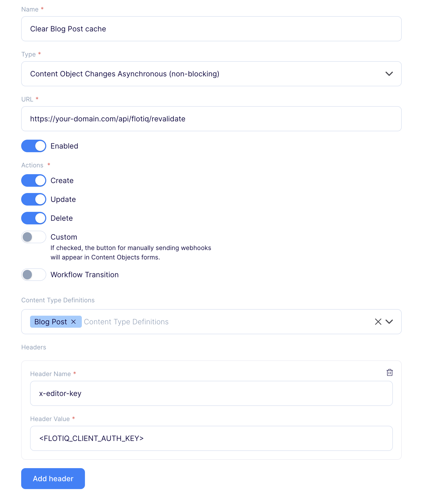

<a href="https://flotiq.com/">
    
</a>

Next.js demo for blog with Flotiq source
===========================

This is a modern, fully-featured blog website built with Next.js and powered by Flotiq headless CMS. It showcases how to create a professional blog website with dynamic content management, internationalization, and modern web development best practices.

Check our live demo: [https://demo-blog.flotiq.com/](https://demo-blog.flotiq.com/) 

## Key Features

**🌐 Internationalization**
- Multi-language support (English and Polish included)
- Automatic language detection and switching
- Localized content management through Flotiq

**🎨 Modern UI/UX**
- Built with Tailwind CSS for responsive design
- Smooth animations and transitions

**⚡ Performance & Developer Experience**
- Next.js with App Router and Turbopack
- TypeScript for type safety
- Flotiq SDK with auto-generated types
- ESLint and Prettier for code quality
- Optimized images with Next.js Image component

**🔧 Technical Features**
- Server-side rendering (SSR) and static generation
- SEO-friendly with proper meta tags
- Responsive design for all screen sizes
- Git-based content versioning through Flotiq

## Getting Started

### Environment variables

Prepare .env.local file (data and plugins):
```
FLOTIQ_API_KEY=RO_KEY
FLOTIQ_EDITOR_KEY=KEY_FROM_PREVIEW_PLUGIN
PUBLIC_URL=http://localhost:3000
```

or use flotiq-setup:
```bash
npx flotiq-setup --nextjs
```

If you want to read more about our flotiq-nextjs-setup CLI, refer to our [Flotiq NextJS docs](https://flotiq.com/docs/Universe/nextjs/nextjs-setup/).

### Importing data to the Flotiq

Import data to your space:
```bash
npx flotiq-cli import .flotiq [flotiqApiKey]
```

_Note: You need to put your Read and write API key as the `flotiqApiKey` for import to work, You don't need any content types in your account._

#### Content Types

The project includes pre-configured Flotiq content types:
- **Blog Post**: Blog post items with content, header image, author and category
- **Author**:  Blog post author names and avatars
- **Category**: Blog post categories

#### Plugins

If you want, to manage content for different languages or see changes in realtime, you need to add following plugins to your Flotiq account:
- **Live preview**

### Development

Install dependencies:

```bash
yarn
```

Run the development server:

```bash
yarn dev
```

Open [http://localhost:3000](http://localhost:3000) with your browser to see the result.

### Flotiq codegen - install SDK

This project uses [Flotiq API SDK](https://www.npmjs.com/package/@flotiq/flotiq-api-sdk) library for types safety and IDE autocompletion of user data types.

If you make any changes (additions or deletions) to the `content type definitions` in your Flotiq account, you need to run:

```
yarn exec flotiq-api-typegen
```

### Code format and lint

Enable eslint and prettier in the IDE when making changes to the code.

For ensuring correct formatting:

```
yarn lint
yarn format
```

## Learn More

To learn more about Next.js, take a look at the following resources:

- [Next.js Documentation](https://nextjs.org/docs) - learn about Next.js features and API.
- [Learn Next.js](https://nextjs.org/learn) - an interactive Next.js tutorial.

You can check out [the Next.js GitHub repository](https://github.com/vercel/next.js) - your feedback and contributions are welcome!

If you want to learn more about Flotiq, take a look at the Flotiq documentation:

- [Flotiq Documentation](https://flotiq.com/docs/)

## Deploy on Vercel

The easiest way to deploy your Next.js app is to use the [Vercel Platform](https://vercel.com/new?utm_medium=default-template&filter=next.js&utm_source=create-next-app&utm_campaign=create-next-app-readme) from the creators of Next.js.

Check out our [Next.js deployment documentation](https://nextjs.org/docs/app/building-your-application/deploying) for more details.

[](https://vercel.com/new/clone?repository-url=https%3A%2F%2Fgithub.com%2Fflotiq%2Fflotiq-demo-blog-nextjs&env=FLOTIQ_API_KEY,FLOTIQ_EDITOR_KEY&envDescription=Variables%20needed%20for%20the%20application.&envLink=https%3A%2F%2Fgithub.com%2Fflotiq%2Fflotiq-demo-blog-nextjs%3Ftab%3Dreadme-ov-file%23env-variables)

You can also deploy this project to [Heroku](https://www.heroku.com/) in 3 minutes:

[](https://www.heroku.com/deploy?template=https://github.com/flotiq/flotiq-demo-blog-nextjs)

Or to [Netlify](https://www.netlify.com/):

[](https://app.netlify.com/start/deploy?repository=https%3A%2F%2Fgithub.com%2Fflotiq%2Fflotiq-demo-blog-nextjs)

### Env variables:

Project requires the following variables to start:

| Name                | Description                                                             |
|---------------------|-------------------------------------------------------------------------|
| `FLOTIQ_EDITOR_KEY` | The key used to [revalidate cache](#nextjs-data-cache) and live preview |
| `FLOTIQ_API_KEY`    | Flotiq Read API key for blogpost content objects                        |

### Next.js Data Cache

This starter utilizes a [data caching mechanism in the Next.js application](https://nextjs.org/docs/app/building-your-application/caching#data-cache). After fetching, the data is cached, which means that the cache must be cleared to see the latest data. In this starter, we provide a special API endpoint that clears the cache. You can call it directly or use webhooks that will do it automatically after saving a blog post (both for adding a new entry and editing an existing one).

#### API Endpoint

To send a request to the endpoint that clears cache, use following command:

```bash
curl -X POST https://your-domain.com/api/flotiq/revalidate \
     -H "x-editor-key: <FLOTIQ_EDITOR_KEY>"
```

Replace `https://your-domain.com` with your actual `URL` and `FLOTIQ_EDITOR_KEY` with the appropriate authorization key value.

#### Webhooks in Flotiq space

To add a webhook that automatically clears the cache after saving any object, follow these instructions:

1. Go to [Flotiq dashboard](https://editor.flotiq.com/login)
2. Go to the _Webhooks_ page and click _Add new webhook_
3. Name the webhook (e.g. Clear portfolio cache)
4. Paste the URL to your revalidate endpoint, eg. `https://your-domain.com/api/flotiq/revalidate`
5. As a webhook type choose **Content Object Changes Asynchronous (non-blocking)**
6. Enable the webhook
7. As a trigger, choose **Create**, **Update** and **Delete** actions on all Content Types
8. Add new header with following fields:
    - **Header Name** - `x-editor-key`
    - **Header Value** - value for `FLOTIQ_EDITOR_KEY` env variable in your deployment
9. Save the webhook

Example webhook configuration:



**Warning!** The webhook URL must be public. In development mode, caching is not applied, so the user does not need to worry about manually clearing the cache on `http://localhost:3000`.

## Collaborating

If you wish to talk with us about this project, feel free to hop on our [](https://discord.gg/FwXcHnX).

If you found a bug, please report it in [issues](https://github.com/flotiq/flotiq-demo-portfolio-nextjs/issues).